<div align="center">

<!-- 3D Animated Isometric Header Banner -->
<a href="https://github.com/devtdq1701">
  
</a>

<br/><br/>

[](https://t.me/quangtd)
&nbsp;
[](mailto:dangquang.170120@gmail.com)
&nbsp;
[](https://www.facebook.com/DQ1701/)

<br/>

</div>

---

### 🕹️ `devtdq1701@infra-node:~$ sudo systemctl status platform`

```yaml
● platform.service - High-Availability Cloud Infrastructure
     Loaded: loaded (/etc/systemd/system/platform.service; enabled)
     Active: active (running) since 2020; 99.999% SLA
   Engineer: "Trần Đăng Quang (devtdq1701)"
       Role: "Senior DevOps & Cloud Platform Infrastructure Architect"
   Location: "Hanoi, Vietnam 🇻🇳"
     Engine: "Kubernetes (RKE2) • Kyverno • Docker • Python • Terraform"
  Telemetry: "Prometheus • Grafana • Zabbix • Loki"
     Mantra: "Automate everything, fail gracefully, scale effortlessly."
```

---

### 🚀 Tech Arsenal & 3D Stack Matrix

<div align="center">

<a href="https://skillicons.dev">
  
</a>

<br/><br/>

<table>
  <thead>
    <tr style="border-bottom: 2px solid #00F0FF;">
      <th align="left" width="28%">Domain</th>
      <th align="left">Technologies &amp; Architecture</th>
    </tr>
  </thead>
  <tbody>
    <tr>
      <td><strong>☁️ Cloud &amp; Containers</strong></td>
      <td><code>Kubernetes (RKE2)</code> <code>Docker</code> <code>Helm</code> <code>Terraform</code> <code>Kyverno Policies</code></td>
    </tr>
    <tr>
      <td><strong>⚡ CI/CD &amp; Automation</strong></td>
      <td><code>GitHub Actions</code> <code>GitLab CI</code> <code>Ansible</code> <code>Bash</code> <code>Python Automation</code></td>
    </tr>
    <tr>
      <td><strong>📊 Observability &amp; SRE</strong></td>
      <td><code>Prometheus</code> <code>Grafana</code> <code>Zabbix</code> <code>Elasticsearch</code> <code>Loki</code></td>
    </tr>
    <tr>
      <td><strong>🛡️ Security &amp; Registry</strong></td>
      <td><code>Sonatype Nexus 3</code> <code>Harbor</code> <code>HashiCorp Vault</code> <code>Nessus Scanner</code></td>
    </tr>
    <tr>
      <td><strong>🐍 Core Languages</strong></td>
      <td><code>Python 3.12</code> <code>Go</code> <code>POSIX Shell / Bash</code> <code>SQL</code></td>
    </tr>
  </tbody>
</table>

</div>

---

### 📦 Highlighted Open-Source Project

<div align="center">

### ⚡ [**`nexus-cli`**](https://github.com/devtdq1701/nexus-cli)
*A high-performance Python 3 CLI tool to automate and manage Sonatype Nexus Repository Manager 3 (NXRM3) instances.*

</div>

- 📊 **Storage Breakdown & Analytics**: Multi-repository disk scan, Docker image space aggregation, and TTL caching.
- 🐳 **Per-Image Docker Retention**: Independent retention filtering (`--keep-last <N>`), age pruning (`--older-than 30d`), regex protection, and dry-run safety.
- 🛡️ **Anti-Rate-Limiting**: Smart HTTP 429 backoff with `Retry-After` header parsing, jitter, and client pacing.
- 🧹 **Task Automation**: Triggering system maintenance tasks (`Admin - Compact blob store`, `Docker cleanup`).

---

### 🐍 Activity & Contribution Stream

<div align="center">


</div>

---

<div align="center">

```bash
$ echo "Stay curious, build resilient systems, and push to production with confidence."
```

<sub>⚡ GPU-Accelerated 3D SVGs natively hosted on GitHub • 100% Uptime Guaranteed</sub>

</div>
